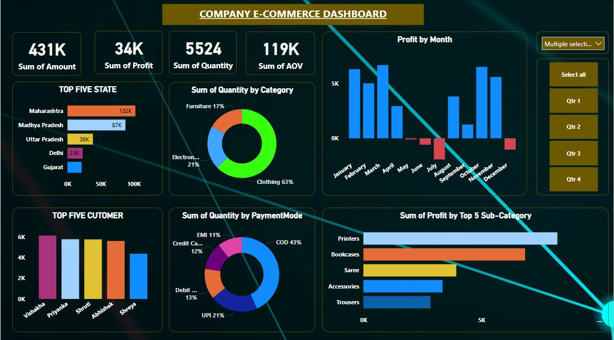
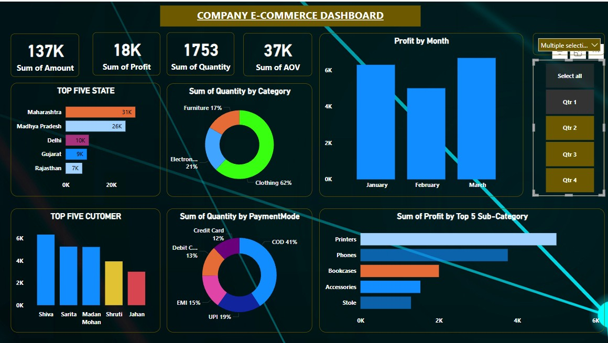

# 📊 Company E-Commerce Dashboard

This Power BI dashboard provides a comprehensive analysis of an e-commerce company’s performance using real-time visualizations and metrics.

## 🔍 Overview

The dashboard presents key performance indicators (KPIs) like:

- **Total Amount:** ₹431K
- **Total Profit:** ₹34K
- **Total Quantity Sold:** 5524
- **Average Order Value (AOV):** ₹119K

It includes insightful visualizations such as:

- Profit by Month  
- Top 5 Performing States  
- Top 5 Customers  
- Category and Sub-Category Analysis  
- Payment Modes  
- Quantity and Profit Distribution

## 📅 Quarterly Analysis

The dashboard is filterable by quarters (Q1–Q4) for period-specific insights. Example breakdown:

- **Q1 Total Profit:** ₹18K  
- **Q1 Quantity:** 1753  
- **Q1 AOV:** ₹37K  

## 🧩 Tools Used

- **Power BI** – for data modeling and dashboard creation  
- **Excel/CSV (optional)** – for data source  
- **DAX** – for calculated metrics and KPIs

## 🖼️ Dashboard Preview

### Full Year View:

### Q1 View:

## 📂 Project Structure

📁 Company-E-Commerce-Dashboard
├── 📁 assets
│   ├── dashboard.jpg
│   └── dashboard1.jpg
├── COMPANY E-COMMERCE DASHBOARD.pbix
└── README.md

## 📌 How to Use

1. Open the `.pbix` file in Power BI Desktop.
2. Explore different visualizations and filter options.
3. Use the quarter slicer for comparative analysis.

---

## 💡 Key Insights

- **Top State:** Maharashtra (₹102K)
- **Top Product Category:** Clothing (63% of sales)
- **Top Payment Mode:** COD (43%)
- **Best Performing Sub-Category:** Printers

---

## 📬 Contact

For any queries or collaboration, feel free to connect.

📧 rohitec2015@gmail.com  
🔗 [GitHub Profile](https://github.com/Rohit29singh)

